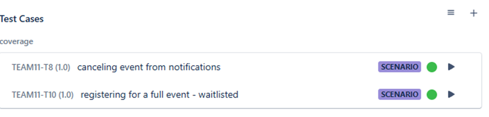

**Collaboration Description**

გუნდში ძალიან ხშირი და პროდუქტიული კომუნიკაცია გვქონდა. ძირითადად დეილი ქოლებზე განვიხილავდით ყველაფერს. 3-სკენ დავრეკავდით ხოლმე, ვიტყოდით ვინ რას ვაკეთებდით და დავგეგმავდით საღამოს 10-მდე რისი გაკეთება გვინდოდა. 10-ზეც იგივე პროცესი მეორდებოდა. ჩატშიც აქტიურად განიხილებოდა შუალედებში პროგრესი და ერთმანეთზე დამოკიდებული როლები.

მე ძირითადად ამ ზარებისას განვიხილავდი ერთიანად ჩემს პროცესს და ვაჯამებდი ნაპოვნ მინუსებსა თუ პლიუსებს, ლიდერს ვუხსნიდი ჩემს სამუშაო პროცესს (devOps-ი იყო და უნდოდა გაეგო როგორ, რანაირად და რატომ ყველაფერზე) და ვათანხმებდი, ვარკვევდი ისეთ საკითხებს როგორებიც იყო: swagger-ის გამოყენება, endpoint-ების შემოწმება (ჩემს backend-თან ცალკე მქონდა მაგ თემაზე შეხვედრა, სადაც ამიხსნა რა და როგორ ხდებოდა), ისეთი კრიტიკული ფუნქციონალების გამართვის აუცილებლობა, რომლებიც პირდაპირ ავტომატიზირებულ სცენარში იყო მოხსენიებული, CI/CD pipeline-ში ჩემი ტესტების ჩადება და ა.შ.

პროექტის განმავლობაში ეტაპობრივად და მანუალურად ვტესტავდი ყველა მზა ფუნქციონალს, რომელსაც მაწვდიდნენ გუნდელები და feedback-საც ვიძლეოდი. Frontend-მა ჩამომაკლონინა თავისი ნამუშევარი და მასთან ხშირი კომუნიკაციით ნელ-ნელა ვამოწმებდი ყველაფერს. წინასწარ ვიცოდი, რომ unit და integration test-ებს ვერ ასწრებდნენ და ჩემით ვტესტავდი, რამდენიმე აღვრიცხე კიდევაც. ისე ხდებოდა ხოლმე, როდესაც ავტომატიზაციას გავწერდი, რაღაც იცვლებოდა, ახალი ვერსია იფუშებოდა და ეგ ტესტები აღარ მუშაობდა, ამიტომაც ხშირი კონტაქტი მიწევდა ჩემს გუნდელებთან ამ მიმართულებით. სანამ, ვთქვათ, ფილტრებს გამართავდნენ — მე სხვა სტეპებს ვწერდი და ა.შ. სულ კავშირზე ვიყავით, რომ დროში ჩავტეულიყავით.

საქმის გაყოფისა და ორგანიზების საკითხები ძალიან გაამარტივა Jira-ზე ტასკების აღრიცხვამ — გუნდი ყოველდღიურ შედეგებს მანდ ავსახავდით ხოლმე და ვინაწილებდით საქმეს. მე მათ მიერ შექმნილ ტასკებს ვუთითებდი შესაბამისად QA: Manual Testing ან QA: Test Automation და ვუწერდი და ვაბამდი შესაბამის test case-ებს, მანუალურად ვტესტავდი თუ ავტომატიზაციის გაკეთებას ვაპირებდი, რომ ყველას ენახა.

მაგ. Waitlist & Cancellation-ზე მიბმული ჩემი სცენარებია:

გამიჭირდა და თავს ვიკავებდი Bug-ების დარეგისტრირებისგან, რადგან ბევრი რამ უბრალოდ ჯერ არ იყო გაკეთებული და Bug-ად ვერ ჩავთვლიდი — თუ რამეს ვიპოვიდი ჯერ ჩემს გუნდელებს ვწერდი, ვგებულობდი ჯერ არდასრულებული ფუნქციონალი იყო, აპირებდნენ თუ არა დამატებას და მაგის მიხედვით ვიცდიდი ან აღვრიცხავდი. (severity-ს field-ის დამატების option მგონი დაბლოკილი იყო, ვერ დავამატე და აღწერაში ვწერდი უბრალოდ). რამდენიმე Bug თავისი აღწერით ჩაგდებული მაქვს ფოლდერში — Bugs & test cases და Jira-ზეც არის ასახული.

ერთადერთი რაზედაც ვერ მოვრიგდით მე და ჩემი გუნდელები იყო id-ების გაწერა, მაგრამ რას ვიზამთ, ასეთი ყოფილა ტესტერების ბედი :)))))

At the end it was stressful but very interesting and fun ^ ^  
That’s all
